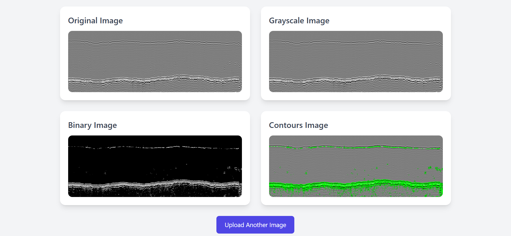

# Contour Mapping and Image Denoising

Below are the two images displayed side by side for visualization.

<div style="display: flex; justify-content: center; gap: 20px; margin-top: 20px;">
    
    
</div>


## Project Description

This project implements an image processing system that follows specific contours in images, maps the bottom contours, and denoises the images. The system processes various types of images, including clean images and those with high spatial frequency variations, using traditional image processing techniques.

### Key Objectives:
1. **Contour Mapping**: The goal is to draw a line that follows the bottom contour of the object(s) in the image, as indicated by the arrows in the project details.
2. **Denoising**: Images should be denoised to reduce noise that can affect the accuracy of contour detection.
3. **Image Variations**: The system should be able to handle a variety of images, including clean images and images with high-frequency spatial variation.

---

## Requirements

- **Python 3.x** 
- **OpenCV**
- **NumPy**
- **Matplotlib**

### Install Dependencies:

```bash
pip install opencv-python-headless numpy matplotlib

---


